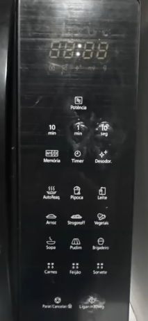

## PAINEL DE MICRO-ONDAS

### Qual é o objetivo principal desse sistema?

Um painel de micro-ondas controla o tempo, a potência e as funções de cozimento do aparelho. Ele serve como a interface principal entre você e a máquina para programar o preparo dos alimentos com facilidade.

### Como é a interação com ele (fácil, difícil, intuitiva, confusa)?

Confusa, por não possuir um teclado numérico, o usuário deve usar as opções preferidas ou os botões de 1 min, 10 segs e 10 min, por exemplo: para colocar 5 minutos, você precisará, apertar o botão de 1 min, 5 vezes, uma ação que com um teclado numérico seria mais rápida, e menos desgastante do que apertar repetidas vezes o mesmo botão.

### Quais elementos da interface chamam a atenção (botões, menus, cores, sons)?

Uma coisa que chama atenção é na verdade algo que a interface padrão de um microondas possui e essa não: um teclado numérico.

### Você já ficou frustrado usando esse sistema? Por quê?

Sim e muito, ao começar com um problema óbvio, ele não possui um teclado numérico, a utilização dele e exclusivamente pelas opções com valores predefinidos, além disso a alguns botões “**problemáticos**”:

* **Botão de ligar/+30s:** um botão comum na maioria dos microondas, mormente quando você apenas aperta esse botão, liga o dispositivo adicionando \+30 segundos, entretanto nesse modelo o botão não faz nenhuma ação até você definir um tempo mínimo, só aí ele passa a adicionar \+ 30 segundos quando pressionado, sendo uma forma não usual do botão.

* **Botão de Sorvete:** Um microondas tem como finalidade esquentar, então porque motivos um microondas teria uma opção para esquentar sorvete?Ao pesquisar descobri que serve para “amolecer” o sorvete, funcionando em uma potência mais baixa, com um tempo de 10 minutos. Acho esse botão uma adição a interface desnecessária, considerando que poucas pessoas usariam esse botão para “amolecer” o sorvete”. Além disso, o pote do sorvete não pode ir no microondas, ou seja, você precisa transferir para um outro recipiente para poder usar a opção de “amolecer o sorvete” do microondas.

Ademais, esse painel apresenta um problema clássico de todo microondas, 
as opções  
predefinidas não são muito usuais considerando que muitas vezes elas não conseguem esquentar da forma correta o alimento, com por exemplo, 
**o botão de pipoca** quase sem deixa a pipoca queimada ou estoura muito pouco, 
sendo inclusive recomendado que você olhe o tempo sugerido na embalagem da pipoca o tempo a ser colocado manualmente.