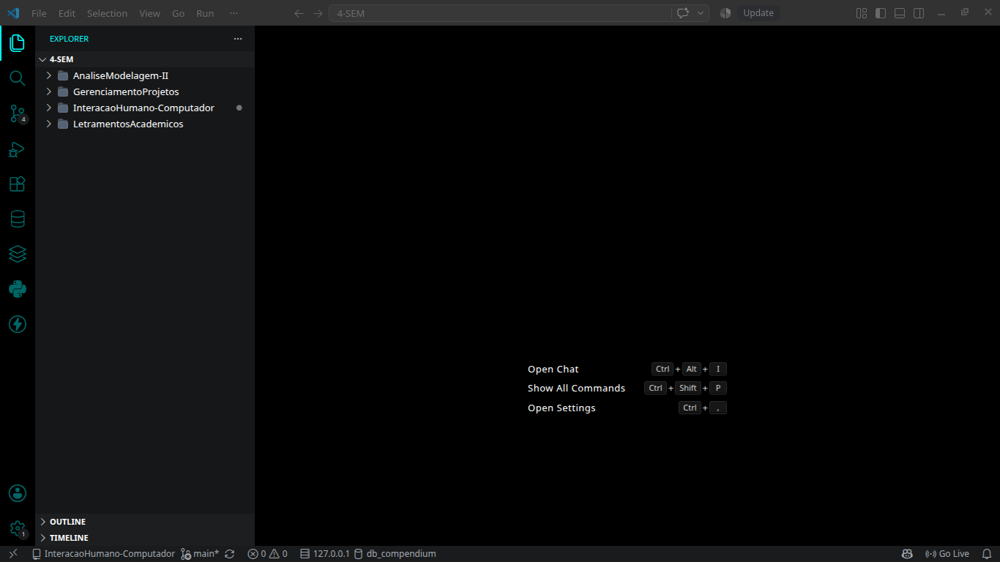

## VISUAL CODE STUDIO 

### Qual é o objetivo principal desse sistema?

O Visual Studio Code é um editor de código-fonte utilizado principalmente para desenvolver programas e aplicações. Ele permite escrever, editar, organizar e executar códigos de diferentes linguagens de programação, além de oferecer recursos como extensões, terminal integrado, depuração e gerenciamento de projetos.

### Como é a interação com ele (fácil, difícil, intuitiva, confusa)?

Relativamente fácil e intuitiva para tarefas básicas, como abrir arquivos, criar pastas e editar códigos. A interface organiza os principais recursos em uma barra lateral, facilitando o acesso. Porém, algumas funções mais avançadas podem ser difíceis de encontrar ou configurar, principalmente para usuários iniciantes.

### Quais elementos da interface chamam a atenção (botões, menus, cores, sons)?

Os elementos que mais chamam a atenção são os da **barra lateral esquerda**, com vários ícones para acessar o Explorer, pesquisa, controle de versão, debug, extensões e outras ferramentas adicionais como o Spring Boot. Também se destacam o **menu superior** que possui ferramentas gerais da aplicação, a área de arquivos e pastas do projeto, **e a barra inferior** que mostra ícones para informações importantes como a branch do projeto, erros/avisos, linha \+ coluna do cursor de texto, linguagem do arquivo aperto, Copilot(IA integrada), e até o sistema de codificação de caracteres(UTF-8).

### Você já ficou frustrado usando esse sistema? Por quê?

Um pouco, quando ainda estava conhecendo a interface, tive alguma dificuldade para encontrar certas funcionalidades específicas, como por exemplo a configuração de atalho de teclado. Mas o que mais me incomoda é a presença forçada da IA Copilot, algo recorrente dos produtos oferecidos pela empresa Microsoft. No caso do VS Code, destaca-se o autocompletar da IA sobre sua escrita do código, onde a forma com ele mostra a sugestão de código gera uma confusão entre o que está de fato escrito e o que ela está sugerindo a ser escrito.
